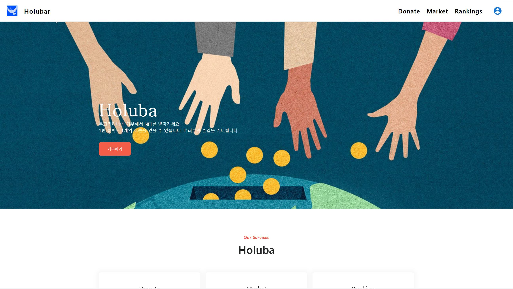
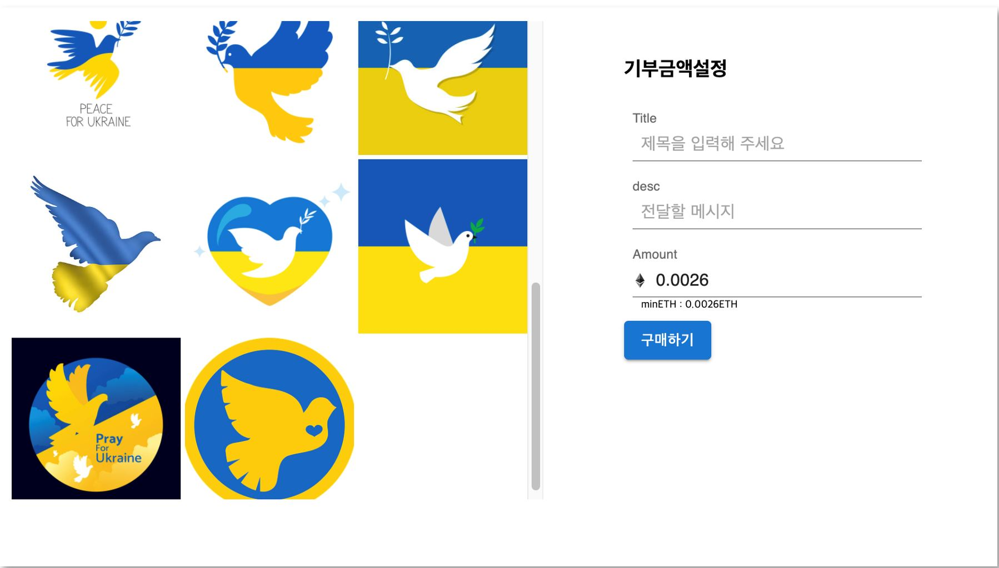
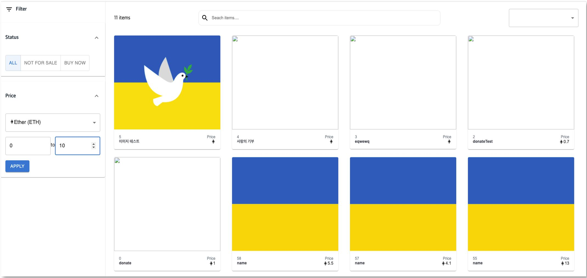

# 기부 플랫폼

NFT를 기반으로 기부자가 기부를 할 수 있는 서비스

## 프로젝트 소개

* 프로젝트명: 기부 플랫폼
* 서비스 특징: NFT 기반 기부 플랫폼
* 주요 기능
  * 기부 중개
  * 기부자의 이름이 각인된 NFT 생성
  * 기부 랭킹 시스템
  * SNS 공유(기부 챌린지)

* 기술 스택
  * Frontend: React.js
  * Backend: Node.js
  * DB: MySQL / AWS S3
  * Contracts: Solidity / Truffle
  * 배포: Docker / Jenkins

## 화면

1. Home



2. donate



3. market




## 배포 프로젝트 URL
* [http://holluba.kro.kr/](http://holluba.kro.kr/)

### 필요한 설정
* Metamask 지갑
* Ropsten Test Network

## 프로젝트 실행 설정
### Docker Compose 설치
* Windows: Docker 사이트를 참조하여 Docker For Windows 설치
  * https://docs.docker.com/docker-for-windows/install/
* Linux
  1. Docker 설치
    ```
    > curl -fsSL https://get.docker.com/ | sudo sh
    > sudo usermod -aG docker $USER
    ```
  2. Docker Compose 설치
    ```
    > sudo curl -L "https://github.com/docker/compose/releases/download/1.24.1/docker-compose-$(uname -s)-$(uname -m)" -o /usr/local/bin/docker-compose
    > sudo chmod +x /usr/local/bin/docker-compose
    > sudo ln -s /usr/local/bin/docker-compose /usr/bin/docker-compose
    ```
### 프로젝트 통합 실행
1. docker-compose.yml 파일을 통해 프로젝트를 실행
    ```
    > docker-compose up
    ```

## Jenkins 사용 시
1. Docker - Jenkins 설치
    ```
    > docker pull jenkins
    ```
2. Docker - Jenkins 설정 및 실행
    ```
    > docker run -d -p [YOUR_EXTERNAL_PORT]:[YOUR_INTERNAL_PORT] -v /jenkins:/var/jenkins_home -v /var/run/docker.sock:/var/run/docker.sock -v /usr/bin/docker:/usr/bin/docker -v /usr/local/bin/docker-compose:/usr/local/bin/docker-compose --name [YOUR_CONTAINER_NAME] -u root jenkins/jenkins:lts
    ``` 
    * 이후 Jenkins 설정 진행
      * 참고 링크: https://dev-overload.tistory.com/40
3. Jenkins Pipeline 사용 설정
    * 참고 링크: https://limsungmook.github.io/2016/11/09/jenkins-pipeline/


## 팀원 및 역할

* 김상희: Smart Contract / DevOps
* 남근호: Frontend
* 박기성: Backend
* 박우경: Frontend
* 이하림: Frontend
* 이홍준: Frontend

## 산출물 

요구사항 명세서

https://liberating-spice-3f8.notion.site/d84b8412ebd04e988abf1ae31da6d639


와이어프레임

https://www.figma.com/file/0DuHmIUgbw7G9c235YtyZT/Untitled?node-id=0%3A1


ERD

https://liberating-spice-3f8.notion.site/ERD-abef046f87964d5e86fc018505a507c2


API 설계

https://liberating-spice-3f8.notion.site/API-c1d453fd2e7b44d9ac6d1f1a48d8e097


시퀀스 다이어그램

https://liberating-spice-3f8.notion.site/5b633d17d107484dbf120056eb0a08e9


시스템 구성도

https://liberating-spice-3f8.notion.site/b11818e3b4224312920cfe2020fc4e77


기타 자료

https://liberating-spice-3f8.notion.site/NFT-74872c6bc67a4bc3a95975df665c9ef0
